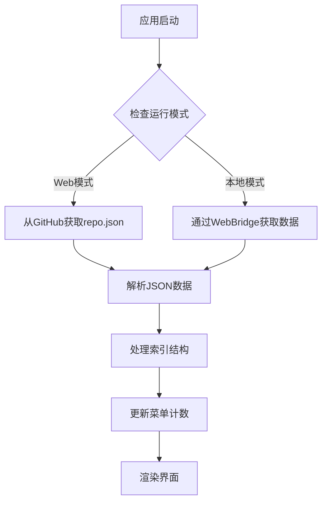

# 🎮 BGI-BSW 脚本仓库

> **BetterGI ScriptsList Web** - BetterGI脚本仓库Web界面

[](https://vuejs.org/)
[](https://vitejs.dev/)
[](https://antdv.com/)

## 📋 目录

- [🚀 构建方式](#-构建方式)
- [🏗️ 项目结构](#️-项目结构)
- [🔄 JSON解析](#-json解析)
- [💬 评论功能](#-评论功能)

---

## 🚀 构建方式

### 开发环境
```bash
# 安装依赖
npm install

# 运行
npm run dev
```

### 生产构建

支持两种构建模式：在线仓库页面与本地仓库页面：

#### 1️⃣ 在线仓库页面
```bash
npm run build
```
#### 2️⃣ 本地仓库页面
```bash
npm run build:single
```
---

## 🏗️ 项目结构

```
bgi-bsw/
├── 📁 src/
│   ├── 🎨 components/
│   │   ├── 📋 lists/           # 列表组件
│   │   │   ├── MapTreeList.vue      # 地图追踪树状列表
│   │   │   ├── ScriptList.vue       # JavaScript脚本列表
│   │   │   ├── CombatStrategyList.vue # 战斗策略列表
│   │   │   └── CardStrategyList.vue   # 七圣召唤策略列表
│   │   ├── 📄 details/         # 详情组件
│   │   │   ├── MapDetail.vue        # 地图详情展示
│   │   │   └── ScriptDetail.vue     # 脚本详情展示
│   │   └── 🎛️ LayoutMain.vue   # 主布局
│   ├── 🎯 App.vue              # 根组件
│   └── 🚀 main.js              # 应用入口
├── ⚙️ vite.config.js           # 普通构建配置
├── 📦 vite.config.single.js    # 单文件构建配置
└── 📋 package.json             # 项目配置
```

### 核心组件说明

#### 🎛️ LayoutMain.vue
- **功能**: 应用主布局，包含左侧菜单、中间列表、右侧详情

#### 📋 列表组件 (lists/)
- **MapTreeList.vue**: 树状结构展示地图追踪资源
- **ScriptList.vue**: 卡片式展示JavaScript脚本
- **CombatStrategyList.vue**: 战斗策略列表
- **CardStrategyList.vue**: 七圣召唤策略列表

#### 📄 详情组件 (details/)
- **MapDetail.vue**: 地图资源详情，支持README和文件列表
- **ScriptDetail.vue**: 脚本详情，支持README渲染

---

## 🔄 JSON解析

### 📊 数据获取流程



### 🔧 数据处理机制

#### 1. 数据源配置
```javascript
// Web模式：从GitHub获取
const response = await fetch('https://raw.githubusercontent.com/babalae/bettergi-scripts-list/refs/heads/main/repo.json');

// 本地模式：通过WebBridge
const repoWebBridge = chrome.webview.hostObjects.repoWebBridge;
const json = await repoWebBridge.GetRepoJson();
```

#### 2. 索引结构处理
```javascript
// 解析四大分类
const indexes = {
  pathing: '地图追踪',
  js: 'JavaScript脚本', 
  combat: '战斗策略',
  tcg: '七圣召唤策略'
};
```

#### 3. 数据转换
- **树状结构**: 地图追踪使用递归处理
- **扁平列表**: 脚本和策略使用数组映射
- **搜索过滤**: 支持拼音和关键词匹配

### 🎯 搜索功能

```javascript
// 拼音搜索支持
import { match } from 'pinyin-pro';

// 多字段搜索
const filteredData = data.filter(item => 
  match(item.title.toLowerCase(), searchText.toLowerCase()) ||
  item.author.toLowerCase().includes(searchLower) ||
  item.tags.some(tag => tag.toLowerCase().includes(searchLower))
);
```

---

## 💬 评论功能

### 🎨 评论系统架构

项目集成了 **Giscus** 评论系统，基于 GitHub Discussions 提供强大的社区互动功能。

#### 🔧 配置信息
```javascript
// 仓库信息需另外更改，详情参考https://giscus.app/zh-CN
const giscusConfig = {
  repo: 'zaodonganqi/bettergi-scripts-web',
  repoId: 'R_kgDOOdJNqw',
  category: 'Q&A',
  categoryId: 'DIC_kwDOOdJNq84CsJV4',
  mapping: 'specific',
  theme: 'light',
  lang: 'zh-CN'
};
```

#### 📱 使用方式

1. **打开评论**: 点击详情页面的评论按钮
2. **查看评论**: 自动加载对应脚本的讨论
3. **发表评论**: 需要GitHub账号授权
4. **互动功能**: 支持点赞、回复、引用

---

## 📄 许可证

本项目采用 Apache License 2.0 许可证 - 查看 [LICENSE](LICENSE) 文件了解详情。

## 🤝 贡献

欢迎提交 Issue 和 Pull Request！

## 🙏 致谢

感谢 [huiyadanli](https://github.com/huiyadanli) 的旧版仓库参考，为本项目提供了宝贵的开发思路和架构参考。

---

## 🌟 相关链接

[BetterGI官网](https://bettergi.com/)

[BetterGI GitHub仓库](https://github.com/babalae/better-genshin-impact)

---

**⭐ 如果这个项目对您有帮助，请给我们一个 Star！**