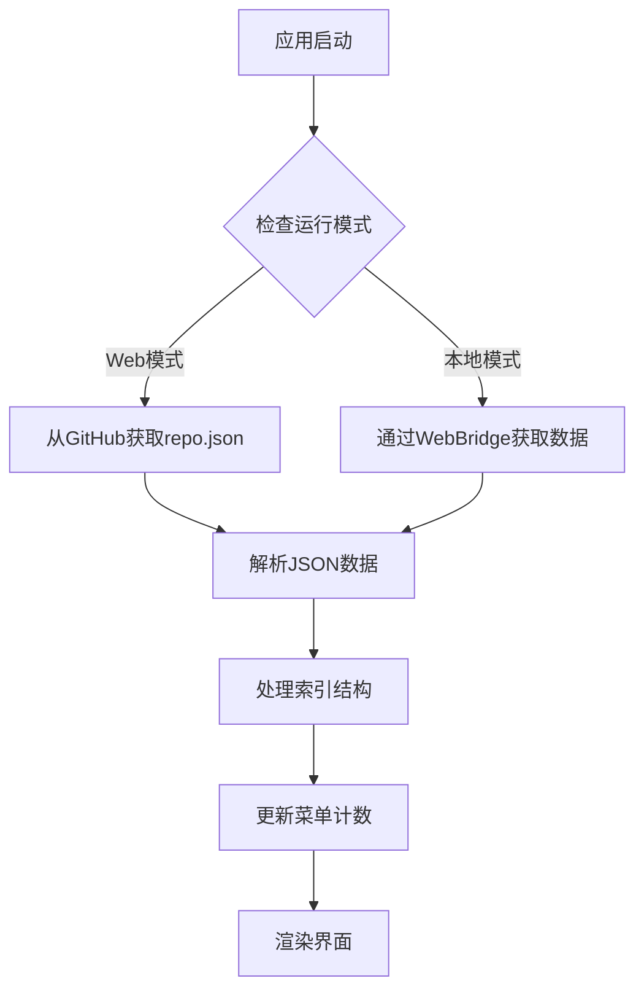

# 🎮 BGI-BSW 脚本仓库

> **BetterGI Scripts Web** - 一个现代化的原神脚本仓库管理界面

[](https://vuejs.org/)
[](https://vitejs.dev/)
[](https://antdv.com/)

## 📋 目录

- [🚀 构建方式](#-构建方式)
- [🏗️ 项目结构](#️-项目结构)
- [🔄 JSON解析流程](#-json解析流程)
- [💬 评论功能](#-评论功能)
- [🎯 功能特性](#-功能特性)
- [🛠️ 技术栈](#️-技术栈)

---

## 🚀 构建方式

### 开发环境
```bash
# 安装依赖
npm install

# 启动开发服务器
npm run dev
```

### 生产构建

项目支持两种构建模式，满足不同的部署需求：

#### 1️⃣ 普通构建 (Standard Build)
```bash
npm run build
```
- 📦 生成多个文件，适合CDN部署
- 🌐 支持模块化加载
- ⚡ 更好的缓存策略

#### 2️⃣ 单文件构建 (Single File Build)
```bash
npm run build:single
```
- 📄 生成单个HTML文件
- 🎯 适合离线使用或简单部署
- 🔧 使用 `vite-plugin-singlefile` 插件
- 📱 便于分发和分享

### 构建配置差异

| 特性 | 普通构建 | 单文件构建 |
|------|----------|------------|
| 输出文件 | 多文件 | 单文件 |
| 部署复杂度 | 中等 | 简单 |
| 加载性能 | 更好 | 一般 |
| 适用场景 | 生产环境 | 离线使用 |

---

## 🏗️ 项目结构

```
bgi-bsw/
├── 📁 src/
│   ├── 🎨 components/
│   │   ├── 📋 lists/           # 列表组件
│   │   │   ├── MapTreeList.vue      # 地图追踪树状列表
│   │   │   ├── ScriptList.vue       # JavaScript脚本列表
│   │   │   ├── CombatStrategyList.vue # 战斗策略列表
│   │   │   └── CardStrategyList.vue   # 七圣召唤策略列表
│   │   ├── 📄 details/         # 详情组件
│   │   │   ├── MapDetail.vue        # 地图详情展示
│   │   │   └── ScriptDetail.vue     # 脚本详情展示
│   │   └── 🎛️ LayoutMain.vue   # 主布局组件
│   ├── 🎯 App.vue              # 根组件
│   └── 🚀 main.js              # 应用入口
├── ⚙️ vite.config.js           # 普通构建配置
├── 📦 vite.config.single.js    # 单文件构建配置
└── 📋 package.json             # 项目配置
```

### 核心组件说明

#### 🎛️ LayoutMain.vue
- **功能**: 应用主布局，包含左侧菜单、中间列表、右侧详情
- **特性**: 
  - 响应式三栏布局
  - 动态菜单切换
  - 全局状态管理
  - 错误处理和加载状态

#### 📋 列表组件 (lists/)
- **MapTreeList.vue**: 树状结构展示地图追踪资源
- **ScriptList.vue**: 卡片式展示JavaScript脚本
- **CombatStrategyList.vue**: 战斗策略列表
- **CardStrategyList.vue**: 七圣召唤策略列表

#### 📄 详情组件 (details/)
- **MapDetail.vue**: 地图资源详情，支持README和文件列表
- **ScriptDetail.vue**: 脚本详情，支持Markdown渲染

---

## 🔄 JSON解析流程

### 📊 数据获取流程



### 🔧 数据处理机制

#### 1. 数据源配置
```javascript
// Web模式：从GitHub获取
const response = await fetch('https://raw.githubusercontent.com/babalae/bettergi-scripts-list/refs/heads/main/repo.json');

// 本地模式：通过WebBridge
const repoWebBridge = chrome.webview.hostObjects.repoWebBridge;
const json = await repoWebBridge.GetRepoJson();
```

#### 2. 索引结构处理
```javascript
// 解析四大分类
const indexes = {
  pathing: '地图追踪',
  js: 'JavaScript脚本', 
  combat: '战斗策略',
  tcg: '七圣召唤策略'
};
```

#### 3. 数据转换
- **树状结构**: 地图追踪使用递归处理
- **扁平列表**: 脚本和策略使用数组映射
- **搜索过滤**: 支持拼音和关键词匹配

### 🎯 搜索功能

```javascript
// 拼音搜索支持
import { match } from 'pinyin-pro';

// 多字段搜索
const filteredData = data.filter(item => 
  match(item.title.toLowerCase(), searchText.toLowerCase()) ||
  item.author.toLowerCase().includes(searchLower) ||
  item.tags.some(tag => tag.toLowerCase().includes(searchLower))
);
```

---

## 💬 评论功能

### 🎨 评论系统架构

项目集成了 **Giscus** 评论系统，基于 GitHub Discussions 提供强大的社区互动功能。

#### 🔧 配置信息
```javascript
const giscusConfig = {
  repo: 'zaodonganqi/bettergi-scripts-web',
  repoId: 'R_kgDOOdJNqw',
  category: 'Q&A',
  categoryId: 'DIC_kwDOOdJNq84CsJV4',
  mapping: 'specific',
  theme: 'light',
  lang: 'zh-CN'
};
```

#### 🚀 功能特性

| 功能 | 描述 | 实现方式 |
|------|------|----------|
| 📝 评论发布 | 支持Markdown格式 | GitHub Discussions API |
| 🏷️ 脚本关联 | 每个脚本独立评论 | 动态term映射 |
| 🎨 主题适配 | 支持明暗主题切换 | CSS变量控制 |
| 🌍 多语言 | 中文界面支持 | 国际化配置 |
| 🔔 实时通知 | GitHub通知系统 | Webhook集成 |

#### 📱 使用方式

1. **打开评论**: 点击详情页面的评论按钮
2. **查看评论**: 自动加载对应脚本的讨论
3. **发表评论**: 需要GitHub账号授权
4. **互动功能**: 支持点赞、回复、引用

### 🎯 评论弹窗实现

```vue
<!-- 评论弹窗组件 -->
<a-modal 
  v-model:open="commentModalOpen" 
  title="评论" 
  :footer="null" 
  centered 
  width="90%"
  class="comment-modal"
>
  <Giscus
    :repo="giscusConfig.repo"
    :repoId="giscusConfig.repoId"
    :term="giscusTerm"
    :theme="giscusConfig.theme"
    :lang="giscusConfig.lang"
  />
</a-modal>
```

---

## 🎯 功能特性

### ✨ 核心功能
- 🗺️ **地图追踪**: 树状结构展示，支持图标显示
- 📜 **脚本管理**: JavaScript脚本浏览和订阅
- ⚔️ **战斗策略**: 战斗相关策略管理
- 🃏 **七圣召唤**: 卡牌策略展示
- 🔍 **智能搜索**: 支持拼音和关键词搜索
- 📱 **响应式设计**: 适配不同屏幕尺寸

### 🎨 用户体验
- 🎯 **直观界面**: 三栏布局，操作便捷
- ⚡ **快速加载**: 异步数据获取，优化性能
- 🎨 **美观设计**: 基于Ant Design Vue
- 🔄 **实时更新**: 自动刷新仓库数据
- 📋 **详细信息**: 支持README和文件列表查看

### 🔧 技术特性
- 🚀 **现代框架**: Vue 3 + Composition API
- ⚡ **快速构建**: Vite开发工具链
- 🎨 **组件化**: 高度模块化设计
- 📱 **单文件部署**: 支持离线使用
- 🔍 **搜索优化**: 拼音匹配算法

---

## 🛠️ 技术栈

### 前端框架
- **Vue 3.4.0** - 渐进式JavaScript框架
- **Vite 5.0.0** - 下一代前端构建工具
- **Ant Design Vue 4.2.6** - 企业级UI组件库

### 核心依赖
- **Vue Router 4.5.0** - 官方路由管理器
- **Pinia 3.0.1** - 状态管理库
- **Axios 1.10.0** - HTTP客户端
- **Markdown-it 14.1.0** - Markdown解析器

### 开发工具
- **Less 4.3.0** - CSS预处理器
- **Highlight.js 11.11.1** - 代码高亮
- **Pinyin-pro 3.26.0** - 拼音匹配库

### 评论系统
- **Giscus 3.1.1** - 基于GitHub Discussions的评论系统

---

## 📄 许可证

本项目采用 MIT 许可证 - 查看 [LICENSE](LICENSE) 文件了解详情。

## 🤝 贡献

欢迎提交 Issue 和 Pull Request！

---

<div align="center">

**🎮 让原神脚本管理更简单！**

[BetterGI官网](https://bettergi.com/) | [GitHub仓库](https://github.com/babalae/better-genshin-impact)

</div> 