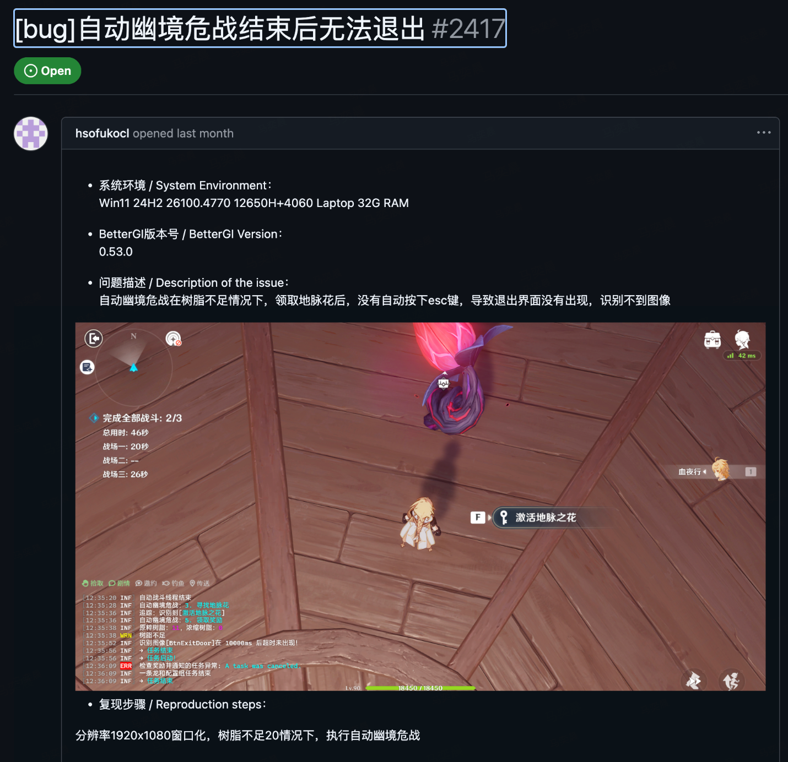

# 如何提问

本文档专为提问小白提供，避免在社区中出现过多低效的提问方式，初次提问信息过于简洁会降低他人为你解答的欲望。  

学习如何提问将是你解决问题的第一步。

> 部分素材引用自官网文档：[如何在Github提问？](https://bettergi.com/tutorial/how_to_ask.html)  

**正确示范：**  

以下截图取自Github Issue，可同理应用到社区提问



## 一、提问标题

在社区中提问的第一句话相当于提问的标题，你应该简单描述你的问题。  

❌ **错误示例：**
```
不好了，出问题了！
这个怎么用？
救命啊！
```

✅ **正确示例：**
```
登录按钮点击没有反应
安装后打不开软件
第3步操作报错：xxx
```

## 二、问题详情

提问时，你应详尽地描述你的问题，而不是草草一句“运行到这里出问题了”了事，虽然非常方便，但是这并不能勾起别人回答你的欲望。  

在后续的问题处理中，你依旧需要配合提供相应的描述，那么为何不在提问时就给出呢？  

> 此处的提问并不需要你了解一些专业知识，只不过是你对问题的陈述

请注意：理想环境下你发生问题的环境不应有其他软件与配置干扰，包括：
* 桌面悬浮窗
* 高负载后台应用
* 公司内网
* 快捷键冲突
* ...

欢迎参考以下的模板编写你的问题详情  

```
一、 我遇到了什么问题：
（在这里简单描述）

二、 问题是怎么发生的：
1. 我先点了XXX
2. 然后又点了XXX
3. 突然就XXX了

三、 我希望的结果：
（描述你希望正常应该是什么样）

四、 我的环境：
- 电脑系统：Windows xx xxxx版本
- 其他相关信息：如BGI版本、运行的脚本版本等
```

## 三、问题日志与截图

仅描述问题过程一般并不能直接解决问题，你还需要提供问题发生时的日志与截图  

### 📋日志
```
运行出现报错时一定要提供的文件，是解决问题的重中之重！
```

什么是日志及如何获取日志可直接参考官网文档：[本地文件](https://bettergi.com/feats/append/files.html#_3-%F0%9F%93%8B-log)中的log部分了解，此处不过多赘述。

### 🎨截图
```
开发者有时并不能仅靠日志就脑补出问题发生时的场景，有截图能更直观地展现问题，录屏更佳。
```

此处有录屏更佳，但以截图为例进行说明  

截图时请注意规范，错误与模糊的图片将没有任何价值且影响观感

❌ **错误示例：**
```
1、手机拍屏
2、截图（录屏）不全
3、与问题无关
```

✅ **正确示例：**
```
1、使用电脑截图（使用什么工具随你定，QQ截屏（录屏）也足够）
2、展示全部的信息，即整个原神或软件窗口（私密信息自行打码）
3、若为录屏，展示了问题发生的全流程
```

## 四、额外事项

社区中提问时的一些其它注意点：

1. 提出问题前请确保你已经看过对应功能、脚本或路线的说明文档（如果有的话），不看说明就提问是很不尊重的行为
2. 如果解答问题的是管理，当ta提出一些需要你配合的事项但你不知道有什么用时，请积极配合
3. 管理不是客服，不会遵循「顾客就是上帝」
4. 软件是开源免费而非付费的，管理与成员都是人，有自己的生活，并没有为你解决问题的义务
5. 也许提供一些解答问题的报酬会让帮助你的人更加开心  
  
  